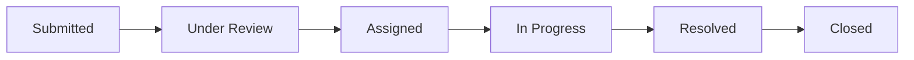

# 🎓 CampusResolve — College Grievance & Complaint Management System

A full-stack, enterprise-grade **College Complaint & Grievance Management System** built with **Next.js**, **Tailwind CSS**, **Node.js**, **Express**, and **Socket.IO**. Designed for students, department staff, and college administration with **AI-assisted triage**, **real-time WebSocket notifications**, **automated SLA escalation**, and **dual-mode database resilience**.

---

## 🌟 Key Features

- **🛡️ Role-Based Access Control (RBAC)**: Dedicated interfaces and permissions for `Student`, `Department Staff`, `Admin (Dean)`, and `Super Admin (Principal)`.
- **⚡ 1-Click Demo Logins**: Instant test switcher to evaluate all 4 user roles in one click without typing credentials.
- **✨ AI-Powered Triage & Deduplication**:
  - Auto-categorizes grievances and suggests the responsible department.
  - Automatically assesses priority (`Critical`, `High`, `Medium`, `Low`) and urgency scores (0–100).
  - Flags duplicate complaints across departments to prevent duplicate staff dispatches.
  - Generates concise executive summaries for administrators.
- **⏱️ Automated SLA Escalation Engine**:
  - Dynamic resolution deadlines: **12h Critical**, **24h High**, **72h Medium**, **120h Low**.
  - Background worker automatically escalates overdue tickets to the Principal & Dean's Escalation Desk.
- **🔌 Real-Time WebSocket Infrastructure**:
  - Instant live updates on ticket progress without refreshing.
  - In-app notification drawer with unread badges and audio chimes.
- **📊 Executive Analytics & CSAT Dashboard**:
  - Department resolution volume and on-time compliance rates.
  - Average resolution speed tracking in hours.
  - Student CSAT 5-star satisfaction ratings and feedback reviews.
  - 1-click export of grievance records to **CSV**.
- **📦 Zero-Setup Local Resilience**:
  - Connects to MongoDB if running; automatically activates high-performance **In-Memory Store** with realistic pre-seeded data if MongoDB is offline.

---

## 🚀 Quick Start (Local Run)

### 1. Prerequisites
- **Node.js** >= v18.0.0 (Tested on Node v20 & v26)
- **npm** >= 9.0.0

### 2. Clone / Open the Workspace
```bash
cd clgmanagement
```

### 3. Install All Dependencies (Single Command)
```bash
npm run install:all
```
*Or install individually:*
```bash
npm install
npm install --prefix server
npm install --prefix client
```

### 4. Start the Application
```bash
npm run dev
```
This runs both the Express backend API (`http://localhost:5000`) and the Next.js frontend (`http://localhost:3000`) concurrently.

### 5. Access in Browser
- **Frontend Web Portal**: [http://localhost:3000](http://localhost:3000)
- **Backend API & Health Check**: [http://localhost:5000/api/health](http://localhost:5000/api/health)

---

## 🔑 Pre-Seeded Demo Test Accounts

You can log in manually using the credentials below, or click any role button on the **Login Page** or **Navbar Role Switcher**:

| Role | Name | Email | Password | Assigned Unit / Department |
| :--- | :--- | :--- | :--- | :--- |
| **Student** | Aarav Sharma | `student@campus.edu` | `password123` | Computer Science (Hostel Kaveri 304) |
| **Student 2** | Priya Patel | `priya@campus.edu` | `password123` | Electronics (Hostel Ganga 112) |
| **Dept Staff (IT)** | Sneha Reddy | `staff.wifi@campus.edu` | `password123` | IT & Wi-Fi Network |
| **Dept Staff (Hostel)** | Rajesh Gupta | `staff.hostel@campus.edu` | `password123` | Hostel & Residential |
| **Dept Staff (Maintenance)**| V. Kumar | `staff.maintenance@campus.edu` | `password123` | Infrastructure & Maintenance |
| **Admin (Dean)** | Dr. M. Sundaram | `admin@campus.edu` | `password123` | Dean of Student Affairs |
| **Super Admin (Principal)** | Prof. K. Narayanan | `principal@campus.edu` | `password123` | Principal & Director |

---

## 🔄 Suggested Complaint Lifecycle Flow



1. **Submitted**: Student lodges grievance with title, location, priority, description, and photo attachments.
2. **Under Review**: Admin triages the issue, verifies AI priority/category recommendation.
3. **Assigned**: Ticket is assigned to a specific department and staff specialist (e.g. IT Engineer / Plumber).
4. **In Progress**: Staff begins physical or technical repair work and posts live audit updates.
5. **Resolved**: Staff records resolution details and fix proof, notifying the student.
6. **Closed**: Student submits 1–5 star resolution rating & review, closing the ticket.

---

## 📂 Project Architecture & Folder Structure

```
clgmanagement/
├── package.json               # Root monorepo orchestrator (npm run dev)
├── README.md                  # Comprehensive local run guide
├── spec.md                    # Project specification (Single Source of Truth)
├── server/                    # Express + Socket.IO Backend
│   ├── package.json
│   ├── .env.example
│   ├── src/
│   │   ├── server.js          # HTTP & WebSocket entrypoint
│   │   ├── config/            # Constants (statuses, SLAs, roles), DB connector
│   │   ├── models/            # User, Complaint, Department, Notification schemas
│   │   ├── store/             # In-Memory Store engine (zero-config fallback)
│   │   ├── seed/              # Pre-seeded users & sample grievances
│   │   ├── services/          # AI Triage & Deduplication, SLA Escalation engine
│   │   ├── middleware/        # JWT Auth, Role Guard, Multer File Upload, Error Handler
│   │   ├── controllers/       # Auth, Complaints, Admin, Analytics, Notifications
│   │   ├── routes/            # REST API endpoints
│   │   └── tests/             # Automated test suite (api.test.js)
│   └── uploads/               # Stored complaint attachment files
└── client/                    # Next.js Modern Frontend
    ├── package.json
    ├── tailwind.config.js
    ├── next.config.js
    └── src/
        ├── context/           # AuthContext, SocketContext, NotificationContext
        ├── components/
        │   ├── layout/        # Navbar, Sidebar, Mobile Bottom Bar, Notification Drawer
        │   ├── common/        # StatusBadge, PriorityBadge, StatsCard, ToastContainer
        │   ├── complaints/    # ComplaintCard, TimelineView, FeedbackModal, StatusUpdateModal
        │   └── ai/            # AIAssistantWidget (live triage & duplicate alert)
        ├── pages/
        │   ├── index.js       # Landing page & quick ticket tracker
        │   ├── login.js       # Authentication & 1-click role switcher
        │   ├── register.js    # Student registration
        │   ├── student/       # Student Portal (Dashboard, New Grievance, Detail View)
        │   ├── admin/         # Admin Master Console, Queue, Analytics, Escalation Desk
        │   └── staff/         # Department Staff Tasks Queue
        └── styles/
            └── globals.css    # Modern dark mode theme with glassmorphism
```

---

## 📡 REST API Reference

### Authentication (`/api/auth`)
- `POST /api/auth/register` — Register a new student profile
- `POST /api/auth/login` — Sign in with email and password
- `POST /api/auth/demo-login` — Instant demo login by role (`student`, `staff.wifi`, `admin`, `principal`)
- `GET /api/auth/me` — Get authenticated user details

### Complaints (`/api/complaints`)
- `POST /api/complaints` — Lodge a new grievance (supports multipart photo upload)
- `POST /api/complaints/ai-triage` — Live AI analysis (department, priority, duplicates, summary)
- `GET /api/complaints/my` — Get complaints filed by the current student
- `GET /api/complaints/:id` — Get single complaint details and audit timeline
- `PATCH /api/complaints/:id/status` — Advance status (`In Progress`, `Resolved`, etc.)
- `PATCH /api/complaints/:id/assign` — Assign department and staff member
- `POST /api/complaints/:id/comments` — Add public update or internal staff note
- `POST /api/complaints/:id/rate` — Submit 1–5 star rating and close ticket

### Admin & Staff Management (`/api/admin`)
- `GET /api/admin/complaints` — Filtered complaints queue (search, status, department, priority)
- `GET /api/admin/escalations` — Critical and SLA-breached complaints
- `POST /api/admin/bulk-status` — Bulk update multiple ticket statuses
- `GET /api/admin/staff` — List all department staff members
- `GET /api/admin/departments` — List active campus departments

### Analytics & Reports (`/api/analytics`)
- `GET /api/analytics/overview` — Resolution rates, average resolution time, SLA %, CSAT
- `GET /api/analytics/export` — Download complete complaints dataset in CSV format

### Notifications (`/api/notifications`)
- `GET /api/notifications` — Current user's notification list and unread count
- `PATCH /api/notifications/:id/read` — Mark notification as read
- `PATCH /api/notifications/read-all` — Mark all notifications as read

---

## 🧪 Running Automated Tests

Run backend unit and integration tests:
```bash
cd server
npm test
```
Validates authentication, AI triage, duplicate detection similarity, complaint lifecycle transitions, and SLA calculations.

---

## ⚙️ Environment Variables

Create `.env` inside `server/` (pre-configured default values provided):
```env
PORT=5000
CLIENT_URL=http://localhost:3000
JWT_SECRET=campus_resolve_super_secret_jwt_key_2026_!#
MONGODB_URI=mongodb://localhost:27017/clgmanagement
# Optional: GEMINI_API_KEY or OPENROUTER_API_KEY for advanced LLM triage
GEMINI_API_KEY=
OPENROUTER_API_KEY=
```

---

## 📄 License
This project is licensed under the MIT License.
